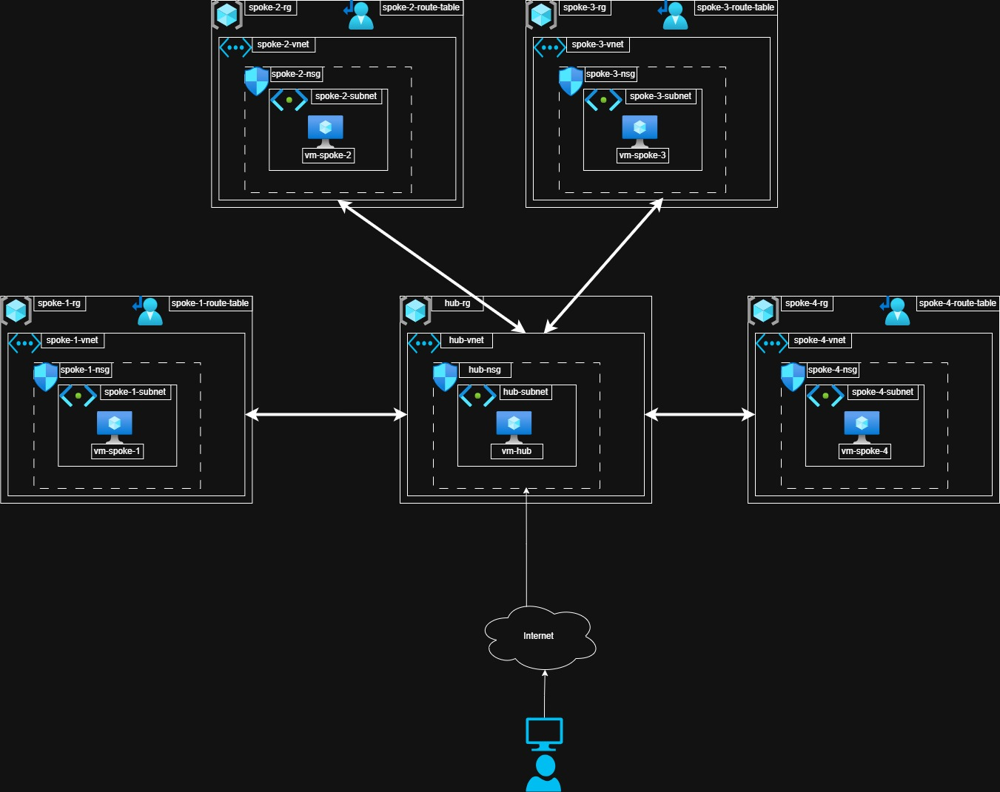

# Hub and Spoke architecture

## Overview

This repository gives a demonstration of how to route between different virtual networks via a central hub network. Though the example uses a single virtual machine in each network, it is extremely illustrative and can be generalised to enterprise and federal spaces.

## Diagram

